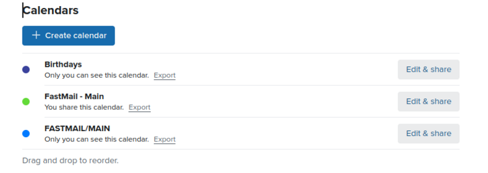

#### Why

With this tool, you can create a task list utilizing your existing Fastmail account, ensuring your to-dos stay synchronized everywhere while maintaining your privacy. Setup takes less than five minutes.

Fastmail does not include a dedicated task management tool with their service. Fortunately, the CalDAV protocol (which Fastmail uses) supports tasks through the VTODO component of the iCalendar format. This project leverages Fastmail's CalDAV implementation to create a task management solution that works seamlessly across Android, Apple, and Windows devices. Any tool that supports CalDAV will work.

##### Prereqs

If necessary first install `uv`.

```
curl -LsSf https://astral.sh/uv/install.sh | sh
```

##### Setup

```
git clone git@github.com:aaron-imbrock/caldav-fastmail.git
cd caldav-fastmail
cp env_example .env
uv sync
source .venv/bin/activate
```

##### Run

1. Go to Fastmail.com to get a CalDav URL for ANY existing calendar. The CalDav URLs can be found under Settings → Calendars, and click the Export link for any calendar. A small pop-up will appear with the URL.
1. Paste this value into the `.env CALDAV_URL` field. This existing calendar will not be changed in any way.
1. Separately create a new app password - make it for "CalDav" access - and paste this value into the `.env CALDAV_PASS` field.
1. The `.env CALDAV_USER` value is your Fastmail user name. This is usually the same as your email address.
1. The `.env CALENDAR_NAME` is whatever you want the calendar title to be. I called it 'FASTMAIL/MAIN'. In `env_sample` it's called 'TODO'. The additional properties assigned will allow both tasks and events in a single calendar, that's ideal although I haven't fully explored this. For now, this calendar is just for tasks.
1. Run `uv run main.py`. The new calendar will be added on the webpage, and iOS will automatically list this calendar under `Reminders`.

I think that's cool.

##### Outcomes



