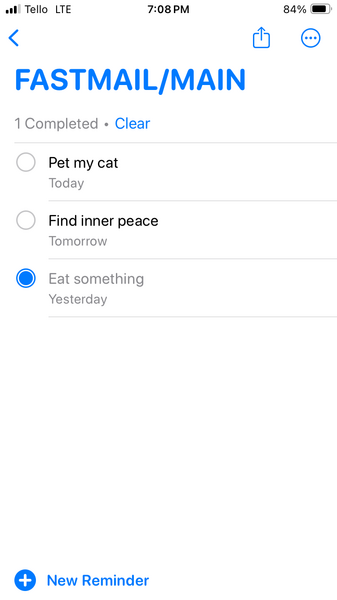

#### Why

We all love Fastmail. They're beloved for their great email and calendar product. They support all email and calendar product's I've ever seen. The one and only thing they don't offer are Tasks.
That's funny because underneath, your iPhone Tasks app is just reading a CalDav calendar, exactly the same as Fastmail. How is that? Apple's Tasks is just a calendar (same as what Fastmail uses) but with the VTODO component enabled.
With a little python and your existing Fastmail account you can have that too. 

This project creates a new Fastmail calendar with added Task capability. It works on anything and everything.

##### Prereqs

If necessary first install `uv`.

```
curl -LsSf https://astral.sh/uv/install.sh | sh
```

##### Setup

```
git clone git@github.com:aaron-imbrock/caldav-fastmail.git --depth 1
cd caldav-fastmail
cp env_example .env
uv sync
source .venv/bin/activate
```

##### Run

1. Go to Fastmail.com to get a CalDav URL for ANY existing calendar. The CalDav URLs can be found under Settings → Calendars, and click the Export link for any calendar. A small pop-up will appear with the URL.
1. Paste this value into the `.env CALDAV_URL` field. Note: We must provide an existing calendar URL to satisfy the CALDAV library requirements, however we never modify that calendar.
1. Separately create a new app password - make it for "CalDav" access - and paste this value into the `.env CALDAV_PASS` field.
1. The `.env CALDAV_USER` value is your Fastmail user name. This is the same as your email address.
1. The `.env CALENDAR_NAME` is whatever you want the new calendar title to be. I called it 'FASTMAIL/MAIN'. In `env_sample` it's called 'TODO'. The additional properties assigned will allow both tasks and events in a single calendar
1. Run `uv run main.py`. Fastmail does not surface The new calendar will be added on the webpage, and iOS will automatically list this calendar under `Reminders`.

I think that's cool.

##### Outcomes



